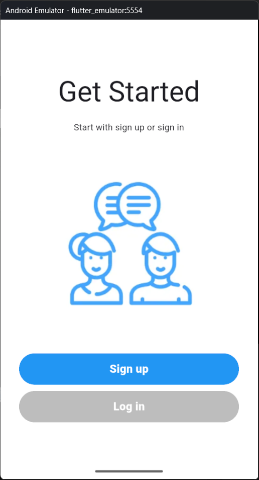
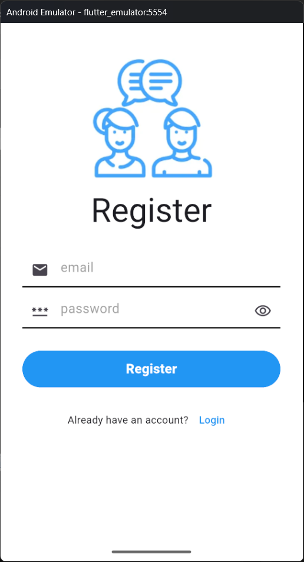
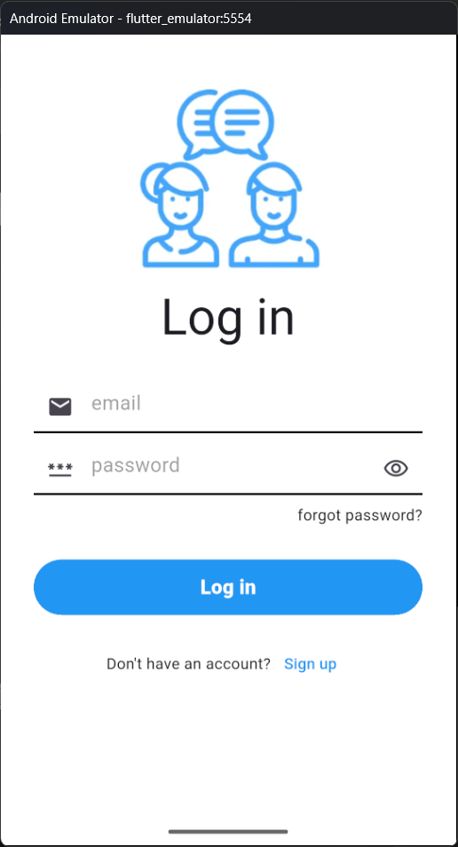
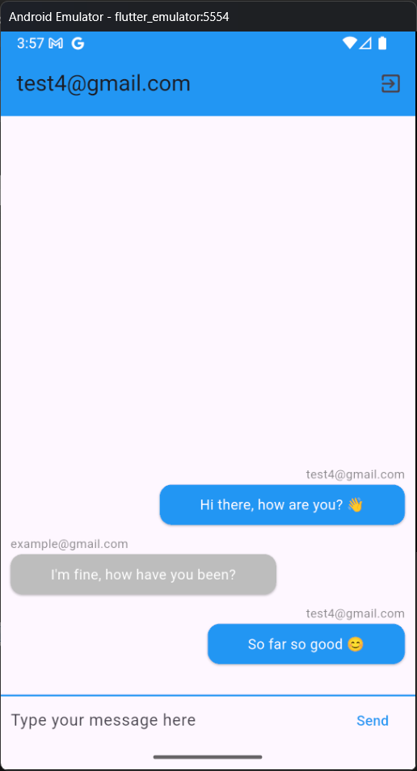
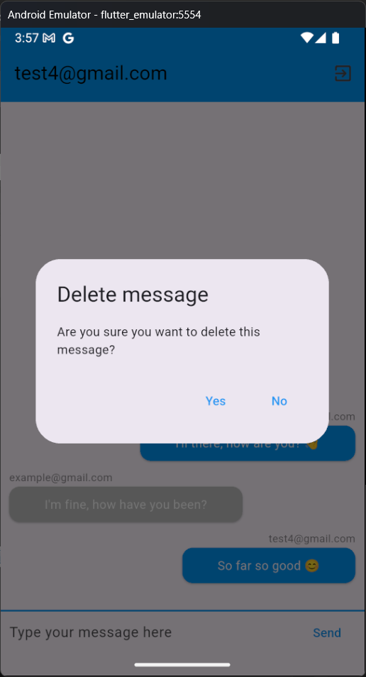
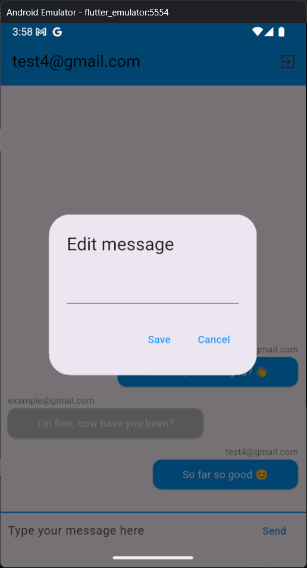

# Flutter Chat App

A chat app build with flutter using firebase authentication, firestore

## Features
- Sign up or log in using email and password
- Sign out
- Send and receive messages
- Realtime chatting
- Display the message sender
- Delete message when long press and edit when double tap

## Important note:
within android/gradle/wrapper/gradle-wrapper.properties, i direct the distributionUrl to a directory in my pc which is not the default

## Technologies
- Flutter
- Firebase Authentication 
- Firebase Firestore (realtime database)

## Setup
1. Download your own `google-services.json` from Firebase Console
2. Place it in `android/app/` directory
3. Repeat for `GoogleService-Info.plist` in `ios/Runner/`

## Screen Shot

- 
- 
- 
- 
- 
- 